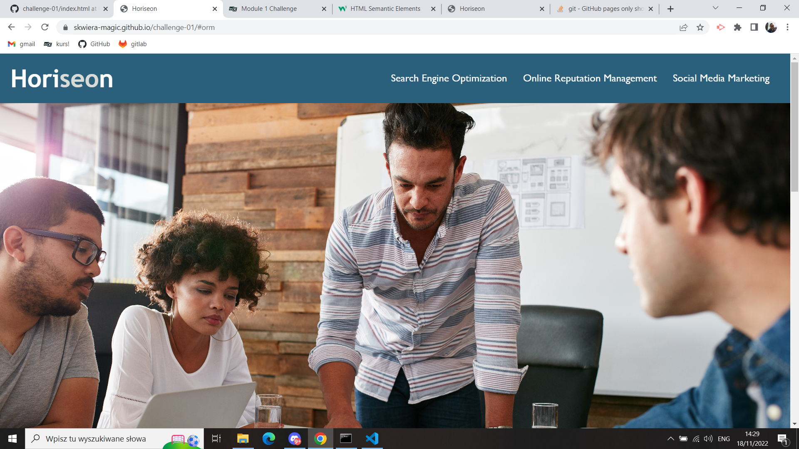

# challenge-01

## Instructions:

* I was looking for ways to improve accessibility of the website provided. 
* Where possible I used html semantics to make it easier for search engines and also provide alt descriptions for all icons and images. 
* Title elements was modified to provide clean and easy description.
* CSS was consolidated and final website deployed to github.

## Demo:

* Here is screenshot of the website:
  
* and also website itself on https://skwiera-magic.github.io/challenge-01/

